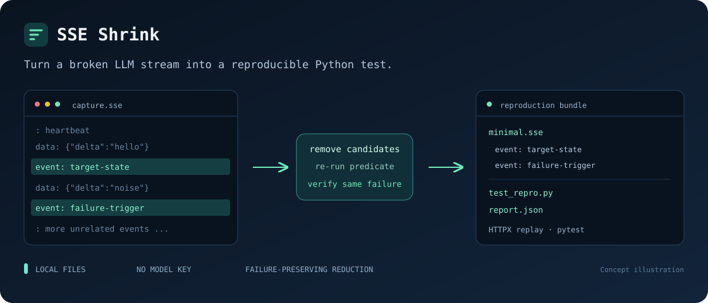

# SSE Shrink

把会触发故障的 LLM 事件流缩减成小型、可复现的 Python 测试。

[English](README.md)



SSE Shrink 以用户编写的 Python 判定函数为准，逐步删除完整的 Server-Sent
Events，同时检查**同一个目标故障**是否仍然存在。它把成熟的
[delta debugging](https://www.st.cs.uni-saarland.de/papers/tse2002/) 方法应用到
SSE 故障样本，原样保留每个入选事件的字节，并导出便于审查的 HTTPX/pytest
复现包。

当一段很长的响应会让解析器、SDK、网关或 AI 应用出错，而大多数事件与故障
无关时，这个工具可以把样本缩到更容易阅读、分享和纳入回归测试的大小。

## 快速开始

SSE Shrink v0.2.0 需要 Python 3.11 或更高版本。可安装
[GitHub Release](https://github.com/cloudwallker/SSE-Shrink/releases/tag/v0.2.0)
中的 wheel，也可从源码安装。本项目尚未发布到 PyPI。

先创建虚拟环境：

```console
python -m venv .venv
```

在 macOS/Linux 上激活虚拟环境：

```sh
source .venv/bin/activate
```

Windows PowerShell：

```powershell
.\.venv\Scripts\Activate.ps1
```

如果 PowerShell 阻止运行激活脚本，可将下方命令中的 `python` 替换为
`.\.venv\Scripts\python.exe`。

从 Release 下载 `sse_shrink-0.2.0-py3-none-any.whl` 到当前目录，安装 wheel
以及运行导出复现测试所需的 pytest：

```console
python -m pip install ./sse_shrink-0.2.0-py3-none-any.whl "pytest>=8,<10"
```

也可以安装 v0.2.0 源码及开发工具：

```console
git clone --branch v0.2.0 https://github.com/cloudwallker/SSE-Shrink.git
python -m pip install -e "./SSE-Shrink[dev]"
```

两种安装方式都可以运行离线演示：

```console
python -m sse_shrink demo --output demo-output --json
python -m pytest demo-output/test_repro.py -q
```

合成 demo 使用刻意写错的解析器，全程离线，不需要模型密钥。它会在
`demo-output/` 下生成 `minimal.sse`、`report.json`、`test_repro.py`、
`predicate.py` 和复现说明。一次已核验的本地运行得到：

```json
{"schema_version":1,"status":"complete","original_bytes":1833,"reduced_bytes":155,"original_events":42,"reduced_events":2,"kept_event_indices":[13,30],"calls":70,"cache_hits":5,"minimality_verified":true,"baseline_verified":true,"fixed_prefix_bytes":0,"incomplete_tail":false,"synthetic_demo":true}
```

这个合成样本从 42 个事件缩为 2 个，从 1,833 字节缩为 155 字节，文件体积减少
91.5%。导出的目标故障保留测试也在本地通过（该次运行结果为 `1 passed in
0.36s`）。这些数字只描述仓库内置样本，不代表吞吐性能，也不表示其他判定函数
会得到相同比例。两个命令都不会打印事件流正文。

## 缩减自己的故障

编写一个接收候选字节的判定函数。只有在**同一个目标故障**出现时才返回内置
`bool` 值 `True`：

```python
# predicate.py
from my_app.streams import TargetParseError, parse_stream


def fails(candidate: bytes) -> bool:
    try:
        parse_stream(candidate)
    except TargetParseError as exc:
        return exc.code == "missing_usage"
    return False
```

可运行的合成判定函数见[演示示例](examples/deliberately_faulty_predicate.py)。

然后处理本地 SSE 文件：

```console
python -m sse_shrink minimize broken.sse \
  --predicate predicate.py:fails \
  --output shrink-output
```

PowerShell 可把命令写成一行，或把 `\` 换成反引号。`--json` 会输出单个可供
程序读取的摘要对象。已有复现包文件默认不会被覆盖，只有显式传入 `--force`
才允许替换。

真实项目的导出包不会复制你的判定文件及其依赖。运行生成的测试时，用环境
变量明确指回原判定函数：

```console
SSE_SHRINK_PREDICATE=predicate.py:fails python -m pytest shrink-output/test_repro.py -q
```

PowerShell：

```powershell
$env:SSE_SHRINK_PREDICATE = "predicate.py:fails"
python -m pytest shrink-output/test_repro.py -q
```

导出测试证明目标故障仍在；修复故障后，应再增加一个应用层断言来证明正确
行为。

## 工具保证

- 拆帧识别 LF、CRLF 和 CR 边界，保留下来的字节不会被改写。
- UTF-8 BOM 与开头空行属于固定前缀；每个完整事件块包含自己的终止符，未
  完成的尾块仍可独立删除。
- 基线、已接受缩减、最终结果和最终单事件删除检查都会重新执行稳定性判定。
  异常、超时、非布尔返回或结果不一致都属于判定错误，不算成功复现。
- 完成状态表示事件级 **1-minimal**：剩余的任意一个可缩减事件被单独删除后，
  判定都不再成立。固定前缀不在这个结论的范围内；1-minimal 也不等于全局
  最短。
- 内置 `ReplayTransport` 是 HTTPX 同步内存 transport，本身不会访问网络。

默认限制为 10 MiB、10,000 个可缩减事件、200 次实际判定调用、每个子进程
5 秒以及 3 次稳定性重复。预算耗尽时可以导出最后一个已验证候选，但会明确
标为 `minimality_verified=false`。如果初始基线在预算内仍未完成验证，则不会
导出复现包。CLI 退出码分别表示成功（`0`）、输入或选项错误（`2`）、目标故障
不存在或移除全部可缩减事件后仍满足判定（`3`）、判定错误/超时/不稳定（`4`）、
预算耗尽（`5`）以及 Ctrl+C 中断（`130`）。使用 `--json` 时，中断会输出单个
错误对象，包含 `status="error"`、`category="interrupted"` 和固定消息，不输出
traceback。成功报告仍使用 `schema_version=1`；v0.2.0 保持 Python API 和缩减规则兼容。

## 边界与安全

缩减不等于脱敏。原始流和最小流仍可能包含模型文本、个人信息、凭据或其他
敏感内容，分享复现包前必须逐项检查。报告不会包含流正文、判定函数的
stdout/stderr 或源文件绝对路径。

判定函数是用户代码。每次调用会在新的限时子进程中执行，以隔离 Python 状态，
但子进程**不是安全沙箱**，只能运行你信任的判定代码。回放 transport 本身离线，
判定函数导入的其他代码仍可能访问网络或文件系统。

超时、通信失败或中断时，运行器会终止并回收它直接启动的 worker，关闭管道。
库调用方仍会收到 `KeyboardInterrupt`，CLI 则将其转换为退出码 130。清理范围
不包含判定函数自行启动的任意后代进程，超时也不是对操作系统启动进程耗时的
严格上限。worker 会先读完候选字节再加载用户代码，避免导入挂起时，Windows
大输入的 stdin 写入先于超时处理阻塞。

`.sse` 文件不能保存原始 TCP 分块与时序。复现测试中的 HTTPX 分块大小只是
显式模拟。

## 与相邻工具的区别

[llm-mock](https://github.com/autopost/llm-mock) 侧重录制与回放；
[AIMock](https://github.com/CopilotKit/aimock) 覆盖更广的协议 mock、时序和故障
注入；[llm-stream-tck](https://github.com/carter51200/llm-stream-tck) 提供合成
流一致性与边界测试。SSE Shrink 从你已经拥有的故障样本出发，按照自定义故障
判定缩减事件序列。它可以与这些工具配合使用。

## 开发

拆帧和内存优化的实测数据、复现命令及性能取舍见[性能基准](docs/performance.md)。

```console
python -m ruff check .
python -m ruff format --check .
python -m build
```

源码归档包含示例判定函数、基准脚本与结果，以及工作流程示意图。分享真实故障样本前，
请检查流内容是否含有敏感信息。本项目使用 [MIT License](LICENSE)。
